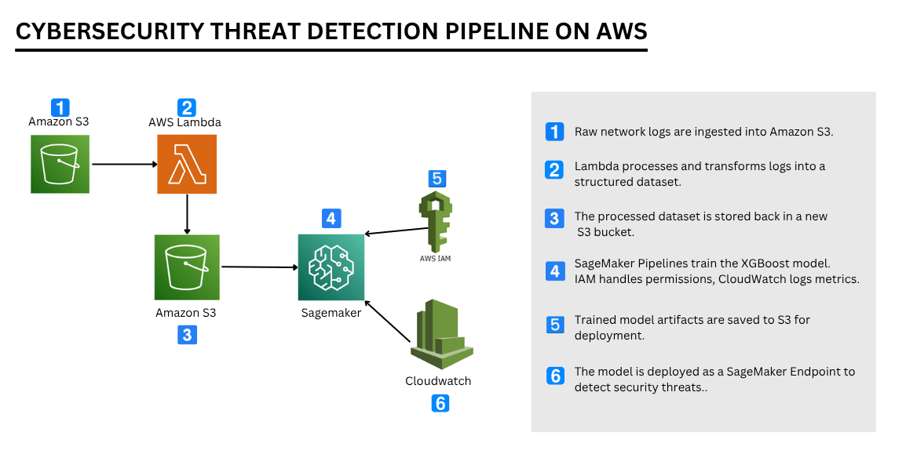

# Cybersecurity Threat Detection with XGBoost

This notebook demonstrates a complete ML pipeline for detecting cybersecurity threats using the UNSW-NB15 dataset and XGBoost classifier on AWS SageMaker.

## Pipeline Overview:
1. **Data Loading**: Download raw dataset from S3
2. **Data Preprocessing**: Feature engineering, encoding, and scaling
3. **Data Preparation**: Train-test split and SageMaker format conversion
4. **Model Training**: XGBoost training on SageMaker
5. **Local Validation**: Train and evaluate model locally
6. **Deployment**: Register model and deploy to SageMaker endpoint
7. **Inference**: Test the deployed endpoint with sample data

## Dataset

**UNSW-NB15 Network Traffic Dataset**
- Source: Network traffic from the University of New South Wales (UNSW)
- Type: Binary classification (benign vs. malicious network traffic)
- Features: 42 network traffic characteristics including:
  - Source/destination bytes and packets
  - Protocol information
  - Service type
  - Connection state
  - Statistical measures (duration, rate, etc.)

## Architecture



## Pipeline Steps

### 1. Load Raw Data from S3
Downloads the UNSW-NB15 training dataset from AWS S3 into a Pandas DataFrame.

### 2. Data Preprocessing & Feature Engineering
- **Drop irrelevant columns**: Removes 'id' and 'attack_cat'
- **Feature engineering**: Creates 3 new features
  - `byte_ratio`: Source to destination byte ratio
  - `is_common_port`: Binary indicator for ports 80, 443, 22
  - `flow_intensity`: Packets per unit time
- **One-hot encoding**: Converts categorical features (proto, service, state)
- **Standardization**: Scales all numerical features to mean=0, std=1

### 3. Upload Preprocessed Data to S3
Saves the processed data to S3 for reproducibility and team sharing.

### 4. Download Preprocessed Data from S3
Retrieves the preprocessed data for train-test split.

### 5. Train-Test Split & Format Conversion
- Splits data: 80% training, 20% testing
- Exports to both CSV (inspection) and LIBSVM (SageMaker format)

### 6. Upload Training & Test Data to S3
Makes formatted data accessible to SageMaker training jobs.

### 7. Configure XGBoost Estimator
Sets up hyperparameters:
- **Objective**: `binary:logistic` (binary classification)
- **num_round**: 100 boosting rounds
- **max_depth**: 5 (prevents overfitting)
- **eta**: 0.2 (learning rate)
- **gamma**: 4 (minimum loss reduction)
- **subsample**: 0.8 (sampling fraction per tree)

### 8. Train XGBoost Model on SageMaker
Executes distributed training on SageMaker with validation on test data.

### 9. Install XGBoost Locally
Installs XGBoost 1.7.6 for local validation and inspection.

### 10. Local XGBoost Training & Evaluation
- Trains model locally with identical hyperparameters
- Evaluates using accuracy and classification metrics
- Validates predictions against test set

### 11. Register Model in SageMaker
Registers the trained model in SageMaker Model Registry for version control.

### 12. Create Endpoint Configuration & Deploy
Deploys the model as a real-time inference endpoint on `ml.m5.large` instance.

### 13. Test Deployed Endpoint
Tests the deployed endpoint with sample network traffic data and verifies predictions.

## Requirements

### AWS Services
- S3 (data storage)
- SageMaker (training and inference)
- IAM (permissions)

### Python Libraries
```
boto3>=1.26.0
sagemaker>=2.0.0
pandas>=1.3.0
scikit-learn>=1.0.0
xgboost==1.7.6
```

### AWS Credentials
Configure AWS credentials with permissions for:
- S3 read/write
- SageMaker training
- SageMaker endpoint creation
- IAM role assumption

## Usage

### 1. Setup
```bash
# Install dependencies
pip install boto3 sagemaker pandas scikit-learn xgboost==1.7.6

# Configure AWS credentials
aws configure
```

### 2. Run the Notebook
Open `cybersecurity_threat_detection_xgboost.ipynb` in JupyterLab or SageMaker Notebook Instance and run cells sequentially.

### 3. Make Predictions
Once the endpoint is deployed:
```python
import boto3

runtime_client = boto3.client("sagemaker-runtime")
response = runtime_client.invoke_endpoint(
    EndpointName="cybersecurity-threat-endpoint",
    ContentType="text/csv",
    Body="0.5,0.3,0.8,0.2,0.1,0.6,0.9,0.4"
)
result = response["Body"].read().decode("utf-8")
prediction = float(result)
label = "THREAT" if prediction > 0.5 else "SAFE"
```

## Output

Binary classification:
- **Score > 0.5**: THREAT (malicious traffic)
- **Score ≤ 0.5**: SAFE (benign traffic)

## References

- [UNSW-NB15 Dataset](https://www.unsw.adfa.edu.au/unsw-canberra-cyber/cybersecurity/UNSW-NB15/)
- [AWS SageMaker Documentation](https://docs.aws.amazon.com/sagemaker/)
- [XGBoost Documentation](https://xgboost.readthedocs.io/)
- [Scikit-learn Preprocessing](https://scikit-learn.org/stable/modules/preprocessing.html)

## License

This project is provided as-is for educational and research purposes.

**Last Updated**: January 1, 2026
